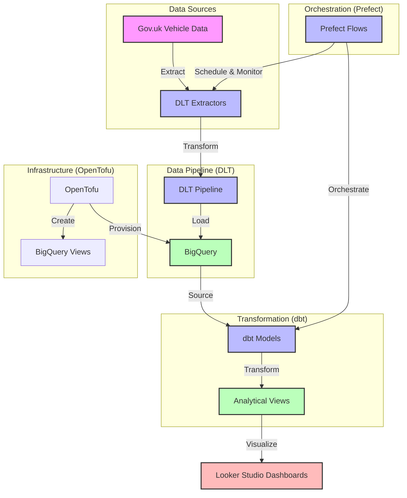
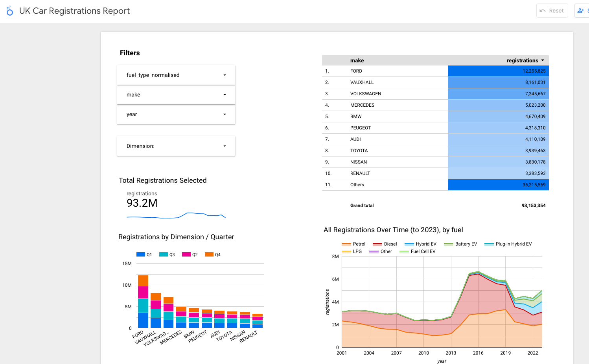
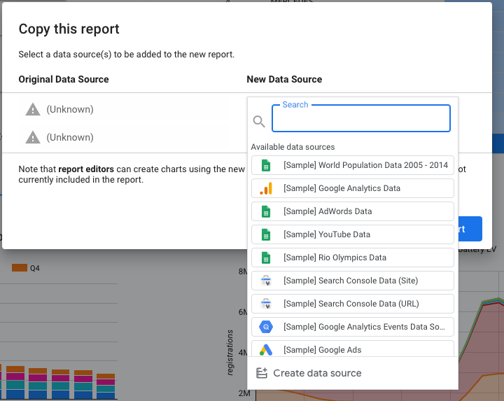

# Vehicle Registrations Data Engineering Project

## Description

This project analyzes vehicle registration trends in the UK, focusing on the adoption of different fuel types (petrol, diesel, battery electric, hybrid) over time.

The project extracts data from the uk.gov car registrations data sets which are up to date as of 2024 Q2. 

The gov.uk data is available here: https://www.gov.uk/government/statistical-data-sets/vehicle-licensing-statistics-data-files

The pipeline automatically downloads this, loads and transforms it like so:




This project helps show the uptake of alternative fuel vehicles over time. 

The data is loaded and then transformed to add useful reporting aggregations so we can see the fuel type adoption over time, and the different fuel types by vehicle manufacturer.


## Tech Stack

The supporting infrastructure and tooling is:

- Google BigQuery for the data warehouse
- Dlthub for copying to GCP storage (data lake) and then ingestion into BigQuery
- DBT for data transformations in BigQuery
- Prefect open-source for orchestrating the load and transformation jobs
- Opentofu for managing the underlying infrastructure
- Looker Studio for visualizing the data
- Make for running the local commands and setup

## Project Structure

```
.
├── dbt/                      # DBT models and configurations
│   ├── models/               # DBT models
│   │   ├── staging/          # Staging models
│   │   └── reporting/        # Reporting models for analysis
│   ├── dbt_project.yml       # DBT project configuration
│   ├── profiles.yml          # DBT connection profiles
│   └── sqlfmt.toml           # SQL formatting configuration
├── dlthub/                   # Data Loading Tool code
│   ├── extractors/           # Data extraction modules
│   │   ├── gov_uk_extractor.py  # UK gov data extractor
│   ├── config.py             # Configuration settings
│   └── pipeline.py           # Main ingestion pipeline module
├── opentofu/                 # OpenTofu (terraform) infrastructure code
├── tests/                    # Test files
│   └── test_dlt_pipeline.py  # Tests for the DLT pipeline
├── dlthub/data               # Temporary data directory (created at runtime)
│   ├── raw/                  # Raw data files
│   └── processed/            # Processed data files
├── requirements.txt          # Python dependencies
└── readme.md                 # Project documentation
```

## Setup Instructions

### Prerequisites

- Python 3.8+
- Google Cloud account with BigQuery and storage enabled
- Google Cloud project already created
- A working gcloud CLI set up with authentication to access it.
- The BigQuery and storage APIs enabled for your CLI user
- Opentofu (for infrastructure setup) 

There is some assistance and documentation on setting these up below. 

Before you begin, please create a project in Google BigQuery if you don't already have an appropriate one to use.

### Installation

1. Clone the repository:
   ```
   git clone <repository-url>
   cd vehicle-data-project
   ```

2. Set up environment variables:
   Create a `.env` file with the following variables in the root of the repo
   
   ```
   cp .env.example .env
   ```
   Change the file to ensure the following env vars are set at the top of the file 
   (you do not need to change the rest of the file)

   ```
   export GCP_PROJECT_ID=my-project-id
   export GCS_LOCATION=europe-west2 # Change if you wish
   export GCS_BUCKET=my-bucket-name
   ```

3. Create and activate a virtual environment:
   ```
   python -m venv .venv
   source .venv/bin/activate  
   
   # On Windows: .venv\Scripts\activate
   ```

4. Ensure you have a gcloud cli installed, following the setup instructions here:
   https://cloud.google.com/sdk/docs/install 

   Setup the default authentication profile by running the following command, and logging in with your browser:
   ```
   gcloud auth application-default login 
   ```

5. Run the python setup script using make. This should install the dependencies, and 
   setup a local instance of prefect server.
   ```
   make setup
   ```

6. Install OpenTofu using the instructions at https://opentofu.org/docs/intro/install/

7. Apply the opentofu configuration to create the cloud infrastructure in GCP:

   ```
   make tofu
   ```

### Running Unit Tests

There are several unit tests to test the download, extract and loading of the data.
You can run these with `make test`. This will generate some duckdb files in the root of the project, and test the data is being loaded there correctly.
To run in BigQuery, continue with the next step.


### Running the Pipeline in Prefect

1. Run the DLT pipeline to download and load data. 
   
   This will also show the pipeline executing in prefect - you can click on the link it generates, or browse to http://localhost:4200/runs
   ```
   make load
   ```

3. Run DBT transformations (again these will execute using prefect)
   ```
   make transformations
   ```

If this all works, you will have a vehicle_data dataset with some tables and views beneath it in BigQuery.

## Data Models

These are the data models which dbt creates in BigQuery.

### Staging Models 
- `stg_unpivot_gov_uk_vehicles`: Normalises the many quarterly columns into rows, add fields for year and quarter. 
Parititioned by year, clustered by fuel type to facilitate better reporting performance.

- `stg_normalised_fuel_types_gov_uk`: Normalisation of fuel types, combining the different PHEV and HEV engine types. 
Partitioned by year and clustered by fuel type.

### Reporting Models
- `rep_aggregations_by_manufacturer`: Analysis of registrations by vehicle manufacturer
- `rep_aggregations_by_fuel_type`: Breakdown of registrations by fuel type


## Setting Up Looker Studio Dashboard

The final step is to look at the looker studio dashboard for the project. 

You can see a public dashboard at the following link:
https://lookerstudio.google.com/reporting/71b10d1a-2802-480d-9d53-c8eb143c0dc5

It looks like the following image:



You can use the filters at the top left to filter by fuel type, manufacturer or year. The default is to display all data.

You can also change the dimension the data is grouped on to focus on fuel type or manufacturer.

You can also if you wish change the reusable data sources to point at the datasets in your own
GCS account instead to test the dashboard against the data pipeline.

To do this:

1. Browse to the public address above when signed in with your own google cloud account
2. Click the three dots at the top right, then 'Make a copy'
3. You may prompted to give Looker Studio access to your account, follow those instructions.
4. On the data source mapping box that appears, click the new source dropdown, then go to the bottom and add a datasource.



5. Choose big query, and add the `rep_aggregations_by_manufacturer` for the first source.
6. For the second source, choose `rep_aggregations_by_fuel_type` 

That's it!


## License

MIT


